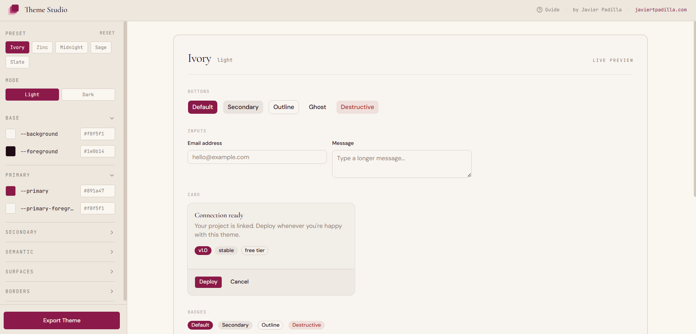

# Theme Studio

A live editor for shadcn/ui themes. Pick a preset, tune individual variables, share the URL, copy the CSS.

[Live Demo →](https://theme-studio-mu.vercel.app) | [Portfolio →](https://javiertpadilla.com)

Portfolio piece by [Javier Padilla](https://javiertpadilla.com) — the only light-mode app in a deliberately dark-mode portfolio.



## What it does

- 5 preset themes: Ivory, Zinc, Midnight, Sage, Slate — each with full light and dark palettes
- Live preview: every shadcn primitive (Button, Card, Badge, Alert, Tabs, Select, Switch, Skeleton, Input, Textarea) renders with the active theme applied via scoped CSS variables. The app chrome stays Ivory; only the preview surface reflects the theme being edited
- Per-variable editing: 19 shadcn variables organized into Base / Primary / Secondary / Semantic / Surfaces / Borders. Each row gets a swatch (click for a `react-colorful` picker), a mono label, and a hex input
- URL state: preset, mode, and every override is serialized to the URL. Share a link, share a theme
- Export: one click reveals the paste-ready `@layer base` block with both `:root` and `.dark` variants. Copy to clipboard or download `globals.css`
- Mobile-aware: below 768px the sidebar collapses into a bottom sheet behind a fixed "Customize" pill

## Stack

Next.js 16 · React 19.2 · TypeScript (strict) · Tailwind CSS 4 · shadcn/ui · react-colorful · Cormorant Garamond + DM Sans + JetBrains Mono

No backend, no database, no API routes — fully static client app, deploys clean to Vercel.

## Architecture notes

- **Scoped CSS variables:** The preview wrapper applies the active theme as inline `--background`, `--primary`, etc. Children using Tailwind's `bg-background` resolve to the wrapper's variables via normal CSS cascade. The app chrome reads its own locked Ivory variables one level up
- **HSL space-separated values:** `--primary: 336 68% 32%` rather than full color functions, matching shadcn's standard format
- **Hex to HSL round-trip** in `lib/colorUtils.ts` — pickers and inputs speak hex; state and exports speak HSL
- **URL deltas, not full theme:** Only variables that diverge from the chosen preset are written to the URL, keeping shareable links readable

## Run locally

```bash
